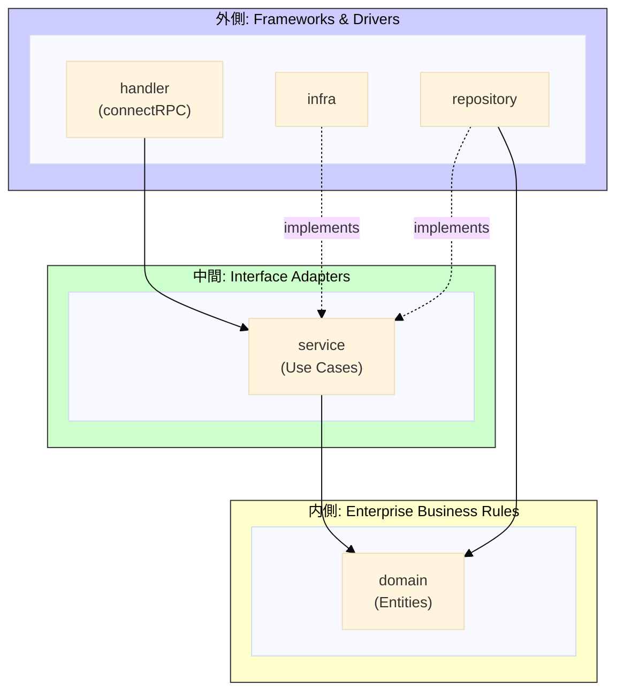

# 設計

## アーキテクチャ

クリーンアーキテクチャに基づいた層構造を採用している。依存関係は外側から内側への一方向のみ許可される。



## ディレクトリ構造

```
server/
├── cmd/
│   ├── main.go                # エントリーポイント
│   └── di/                    # DIコンテナ（Composition Root）
│       ├── container.go       # uber/dig を使用したDIコンテナ
│       ├── handlers.go        # ハンドラ登録
│       ├── auth_service.go    # Auth Service ラッパー
│       ├── image_service.go   # Image Service ラッパー
│       └── interceptor.go     # エラーログインターセプター
│
└── internal/
    ├── domain/                    # ドメイン層（最内層）
    │   ├── game/                  # ゲームEntity・ビジネスロジック
    │   ├── room/                  # ルームEntity
    │   ├── auth/                  # 認証関連ValueObject
    │   ├── user/                  # ユーザーEntity
    │   └── image/                 # 画像Entity
    │
    ├── service/                   # サービス層（ユースケース）
    │   ├── repository.go          # Repositoryインターフェース定義
    │   ├── external.go            # 外部サービスインターフェース定義
    │   ├── errors.go              # 共通エラー定義
    │   ├── game/                  # ゲーム関連ユースケース
    │   ├── room/                  # ルーム管理
    │   ├── auth/                  # 認証・トークン管理
    │   ├── image/                 # 画像アップロード
    │   ├── gemini/                # AI画像解析サービス
    │   ├── health/                # ヘルスチェック
    │   ├── status/                # ステータス確認
    │   └── middleware/            # 認証ミドルウェア
    │
    ├── handler/                   # ハンドラ層（プレゼンテーション）
    │   ├── game/                  # ゲームAPI
    │   └── image/                 # 画像API
    │
    ├── repository/                # Repository層（独立コンポーネント）
    │   ├── game_kvs.go            # KVS使用
    │   ├── room_kvs.go            # KVS使用
    │   ├── anon_kvs.go            # KVS使用
    │   └── identity_db.go         # PostgreSQL使用
    │
    ├── infra/                     # インフラ層（外部接続）
    │   ├── kvs/                   # Valkey(Redis互換)クライアント
    │   ├── blob/                  # MinIO/S3互換ストレージクライアント
    │   ├── gemini/                # Google Gemini AIクライアント
    │   └── db/                    # PostgreSQLクライアント
    │       └── queries/           # sqlc生成コード
    │
    ├── config/                    # 設定管理
    ├── util/                      # ユーティリティ
    │   ├── chrono/                # 時刻操作
    │   └── errors/                # エラーハンドリング
    └── testutil/                  # テスト用ユーティリティ
```

## DIコンテナ（Composition Root）

`cmd/di` はアプリケーションの Composition Root として機能する。uber/dig を使用して依存性注入を行い、全ての具体的な実装をワイヤリングする。

- `cmd/di` は infra 層に依存することが許可される唯一のパッケージ
- ここで interface と実装を結びつける
- ハンドラの登録もここで行う

### 許可される依存

| From | To | 説明 |
|------|-----|------|
| cmd/di | infra/*, repository | DIコンテナは具体的な実装をワイヤリングする |
| cmd/di | service/* | DIコンテナはサービスをワイヤリングする |
| cmd/di | handler/* | DIコンテナはハンドラを登録する |
| handler | service, domain | ハンドラはサービスを呼び出す |
| service | domain/* | ドメインロジック・Entity使用 |
| repository | service, domain, infra | Repositoryインターフェースを実装、infraクライアントを使用 |
| infra/kvs, blob, gemini, db | service | 外部サービスインターフェースを実装 |

### 禁止される依存

- `domain` → `service`, `handler`, `infra`, `repository`（ドメインは外部に依存しない）
- `service` → `infra`, `repository`（サービスはインターフェース経由でのみアクセス）
- `handler` → `infra`, `repository`（ハンドラは直接インフラにアクセスしない）

※ `cmd/di` は Composition Root として特別扱い。全ての具体実装を知る必要がある。

## 技術スタック

### Server

| 用途 | 技術 |
|------|------|
| 言語 | Go |
| API定義 | Protocol Buffers |
| RPC | Connect RPC |
| RDB | PostgreSQL（ユーザー情報） |
| KVS | Valkey（ルーム・ゲーム情報） |
| オブジェクトストレージ | RustFS（画像） |
| AI | Google Gemini（ヒント生成） |

### Web

| 用途 | 技術 |
|------|------|
| 言語 | TypeScript |
| ルーティング | TanStack Router |
| データフェッチ | TanStack Query |
| UIコンポーネント | shadcn/ui |
| 状態管理 | Jotai |
| URLクエリ状態 | nuqs |
