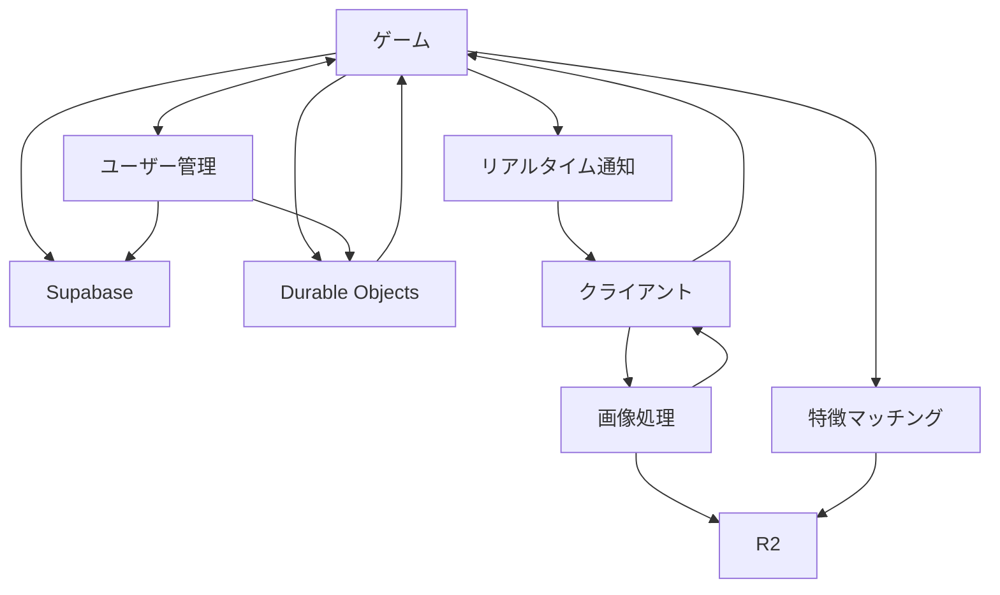

# アーキテクチャ

## ディレクトリ構成

```txt
scene-hunter/
├── api/         # API定義
│   ├── spec/    # TypeSpec
│   └── openapi/ # OpenAPI
├── server/      # バックエンドサーバー
│   ├── bff/     # BFF (TS/Hono, Workers)
│   ├── game/    # ゲームロジック (TS/Hono, Workers)
│   ├── user/    # ユーザー管理・認証 (TS/Hono, Supabase)
│   ├── notify/  # 通知 (TS/Hono, Workers)
│   ├── image/   # 画像処理 (TS/Hono, Workers)
│   └── match/   # 特徴マッチング (Python, CloudRun)
├── web/         # フロントエンド (TS/RR7, Workers)
├── vr/          # VR (C#, Unity)
└── docs/        # ドキュメント
```

## システムアーキテクチャ


```mermaid
graph TD
    Game[ゲーム]
    User[ユーザー管理]
    Notify[リアルタイム通知]
    Image[画像処理]
    Match[特徴マッチング]
    DB[Supabase]
    Durable[Durable Objects]
    Storage[R2]
    
    Client[クライアント] --> Game
    Game <--> User
    Game --> Notify
    Notify --> Client
    
    Client --> Image
    Image --> Client
    Game --> Match
    Game --> DB
    Game --> Durable
    User --> DB
    User --> Durable
    Durable --> Game
    Image --> Storage
    Match --> Storage
```

## コンポーネント詳細

### BFF (Backend For Frontend)
- **役割**: クライアントとバックエンド間のAPI集約・認証・ルーティング
- **技術**: Workers, Hono
- **機能**: APIゲートウェイ、認証、CORS、リクエスト検証

### ゲーム
- **役割**: ゲームのビジネスロジック処理、AI特徴抽出
- **技術**: Workers, Hono
- **機能**: ルーム管理、ゲームフロー制御、スコア計算、AI特徴抽出

### ユーザー
- **役割**: プレイヤー認証・ユーザー情報管理
- **技術**: Workers, Hono, Supabase Auth
- **機能**: JWT認証, 匿名認証, セッション管理, プレイヤー情報管理

### 通知
- **役割**: リアルタイムイベント配信
- **技術**: Workers, Hono, Server-Sent Events (SSE)
- **機能**: ヒント配信、ゲーム状態更新通知

### 画像処理
- **役割**: 画像の管理と処理
- **技術**: Workers, Hono, Wasm
- **機能**: 画像アップロード、変換、保存、取得

### 特徴マッチング
- **役割**: 画像間の一致度計算
- **技術**: Python
- **機能**: スコア計算

### データストア
- **Supabase（PostgreSQL）**: プレイヤー情報、ゲーム履歴、スコア記録
- **Durable Objects（Cloudflare）**: ルーム情報、接続状況、一時データ
- **R2（Cloudflare）**: 画像ストレージ
