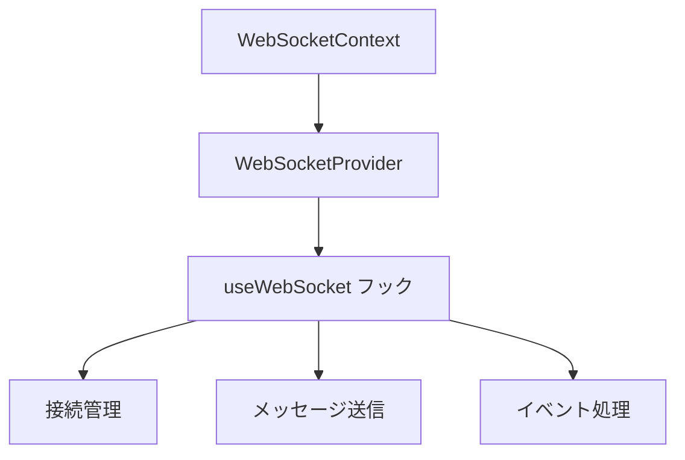
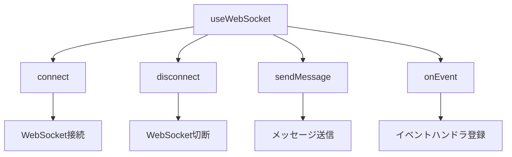
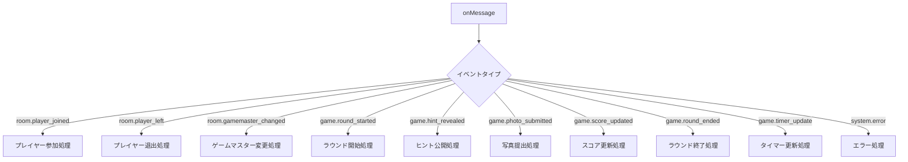
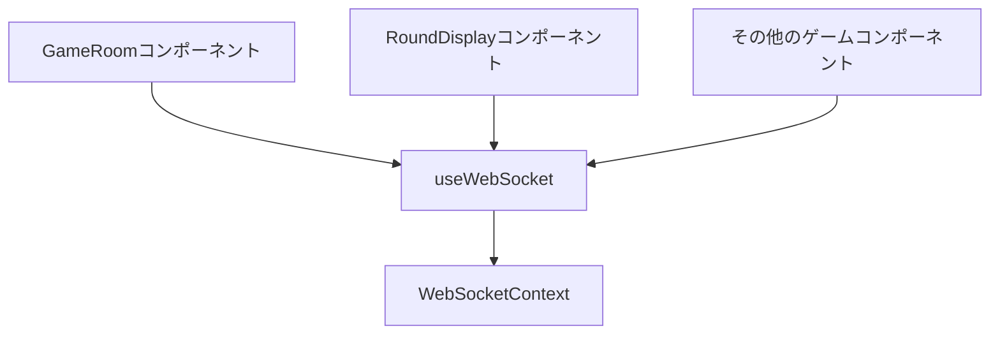

# Scene Hunter WebSocketクライアント実装計画

## 概要

Scene Hunterゲームで、`server/notify`に実装されたWebSocketサーバーを利用してリアルタイムイベントを受信・処理するための実装計画です。

## 現状分析

1. **WebSocketサーバー**:
   - Cloudflare Workers、Hono、Durable Objectsを使用したWebSocketベースの通知サーバー
   - ルームIDごとに部屋を作成し、ユーザーが接続した時のみ部屋が作成される
   - WebSocketを使用したJSON通信でゲームイベントをリアルタイムに配信

2. **クライアント側の現状**:
   - 現在は`ws://localhost:8080`に接続している
   - ゲーム状態はReact Context APIで管理
   - ユーザーIDはフロントエンドで管理

## 実装計画

### 1. WebSocketコンテキストの作成

まず、WebSocket接続を管理するためのReact Contextを作成します。



### 2. WebSocketカスタムフックの実装

WebSocket接続を管理するためのカスタムフックを実装します。



### 3. イベント処理の実装

WebSocketから受信したイベントを処理するためのハンドラを実装します。



### 4. コンポーネントへの統合

各コンポーネントでWebSocketフックを使用してイベントを処理します。



## 具体的な実装ステップ

### ステップ1: WebSocketコンテキストの作成

`web/app/contexts/WebSocketContext.tsx`を作成し、WebSocket接続を管理するためのコンテキストを実装します。

### ステップ2: WebSocketカスタムフックの実装

`web/app/hooks/useWebSocket.ts`を作成し、WebSocket接続を管理するためのカスタムフックを実装します。

### ステップ3: GameRoomコンポーネントの更新

`web/app/routes/gameroom.tsx`を更新し、WebSocketコンテキストを使用してイベントを処理するように変更します。

### ステップ4: その他のコンポーネントの更新

必要に応じて、他のゲームコンポーネント（RoundDisplayなど）も更新し、WebSocketイベントを処理するように変更します。

## コード例

### WebSocketContext.tsx

```tsx
import React, { createContext, useContext, useState, useEffect, useRef, ReactNode } from 'react';
import type { EventType } from '../types/websocket';

interface WebSocketContextType {
  connect: (roomId: string, userId: string) => void;
  disconnect: () => void;
  sendMessage: (message: any) => void;
  isConnected: boolean;
  lastEvent: EventType | null;
  connectionStatus: 'connected' | 'connecting' | 'disconnected' | 'error';
}

const WebSocketContext = createContext<WebSocketContextType | undefined>(undefined);

interface WebSocketProviderProps {
  children: ReactNode;
  maxReconnectAttempts?: number;
  initialBackoffDelay?: number;
  maxBackoffDelay?: number;
}

export const WebSocketProvider: React.FC<WebSocketProviderProps> = ({
  children,
  maxReconnectAttempts = 10,
  initialBackoffDelay = 1000,
  maxBackoffDelay = 30000,
}) => {
  const [socket, setSocket] = useState<WebSocket | null>(null);
  const [isConnected, setIsConnected] = useState(false);
  const [lastEvent, setLastEvent] = useState<EventType | null>(null);
  const [connectionStatus, setConnectionStatus] = useState<'connected' | 'connecting' | 'disconnected' | 'error'>('disconnected');
  
  // 再接続に関する状態を保持するためのRef
  const reconnectAttemptsRef = useRef(0);
  const reconnectTimeoutRef = useRef<number | null>(null);
  const currentRoomIdRef = useRef<string | null>(null);
  const currentUserIdRef = useRef<string | null>(null);
  const isManualDisconnectRef = useRef(false);

  // 指数バックオフを使用して次の再接続までの待機時間を計算
  const getBackoffDelay = () => {
    const delay = Math.min(
      initialBackoffDelay * Math.pow(2, reconnectAttemptsRef.current),
      maxBackoffDelay
    );
    // ジッターを追加して同時再接続を防止（0.5〜1.5倍のランダム係数）
    return delay * (0.5 + Math.random());
  };

  // WebSocket接続を確立する関数
  const connectWebSocket = (roomId: string, userId: string) => {
    if (socket) {
      socket.close();
    }

    // 現在の接続情報を保存
    currentRoomIdRef.current = roomId;
    currentUserIdRef.current = userId;
    
    setConnectionStatus('connecting');

    // 本番環境ではwssプロトコルを使用
    const protocol = window.location.protocol === 'https:' ? 'wss:' : 'ws:';
    const host = 'scene-hunter-notify.yashikota.workers.dev';
    const wsUrl = `${protocol}//${host}/ws/${roomId}?userId=${encodeURIComponent(userId)}`;
    
    console.log(`WebSocket接続を試みています: ${wsUrl}`);
    const ws = new WebSocket(wsUrl);
    
    ws.onopen = () => {
      console.log('WebSocket接続が確立されました');
      setIsConnected(true);
      setConnectionStatus('connected');
      reconnectAttemptsRef.current = 0; // 接続成功したらカウンターをリセット
    };
    
    ws.onmessage = (event) => {
      try {
        const data = JSON.parse(event.data);
        console.log('メッセージを受信しました:', data);
        setLastEvent(data);
      } catch (error) {
        console.error('メッセージの解析に失敗しました:', error);
      }
    };
    
    ws.onclose = (event) => {
      console.log(`WebSocket接続が閉じられました: ${event.code} ${event.reason}`);
      setIsConnected(false);
      setConnectionStatus('disconnected');
      
      // 手動切断の場合は再接続しない
      if (isManualDisconnectRef.current) {
        isManualDisconnectRef.current = false;
        return;
      }
      
      // 再接続ロジック
      if (reconnectAttemptsRef.current < maxReconnectAttempts) {
        const delay = getBackoffDelay();
        console.log(`${delay}ms後に再接続を試みます (試行回数: ${reconnectAttemptsRef.current + 1}/${maxReconnectAttempts})`);
        
        // 前回のタイムアウトをクリア
        if (reconnectTimeoutRef.current !== null) {
          window.clearTimeout(reconnectTimeoutRef.current);
        }
        
        // 再接続をスケジュール
        reconnectTimeoutRef.current = window.setTimeout(() => {
          reconnectAttemptsRef.current += 1;
          
          // 保存されたroomIdとuserIdを使用して再接続
          if (currentRoomIdRef.current && currentUserIdRef.current) {
            connectWebSocket(currentRoomIdRef.current, currentUserIdRef.current);
          }
        }, delay);
      } else {
        console.error('最大再接続試行回数に達しました');
        setConnectionStatus('error');
      }
    };
    
    ws.onerror = (error) => {
      console.error('WebSocketエラー:', error);
      setConnectionStatus('error');
    };
    
    setSocket(ws);
  };

  // 公開する接続関数
  const connect = (roomId: string, userId: string) => {
    // 再接続カウンターをリセット
    reconnectAttemptsRef.current = 0;
    isManualDisconnectRef.current = false;
    
    connectWebSocket(roomId, userId);
  };

  // 切断関数
  const disconnect = () => {
    isManualDisconnectRef.current = true; // 手動切断フラグを設定
    
    // 再接続タイマーをクリア
    if (reconnectTimeoutRef.current !== null) {
      window.clearTimeout(reconnectTimeoutRef.current);
      reconnectTimeoutRef.current = null;
    }
    
    if (socket) {
      socket.close();
      setSocket(null);
      setIsConnected(false);
      setConnectionStatus('disconnected');
    }
    
    // 接続情報をクリア
    currentRoomIdRef.current = null;
    currentUserIdRef.current = null;
  };

  // メッセージ送信関数
  const sendMessage = (message: any) => {
    if (socket && isConnected) {
      try {
        socket.send(JSON.stringify(message));
      } catch (error) {
        console.error('メッセージ送信エラー:', error);
      }
    } else {
      console.error('WebSocketが接続されていません');
    }
  };

  // コンポーネントがアンマウントされたときにWebSocket接続を閉じる
  useEffect(() => {
    return () => {
      disconnect();
    };
  }, []);

  return (
    <WebSocketContext.Provider value={{ 
      connect, 
      disconnect, 
      sendMessage, 
      isConnected, 
      lastEvent,
      connectionStatus
    }}>
      {children}
    </WebSocketContext.Provider>
  );
};

export const useWebSocket = () => {
  const context = useContext(WebSocketContext);
  if (context === undefined) {
    throw new Error('useWebSocketはWebSocketProviderの中で使用する必要があります');
  }
  return context;
};
```

### GameRoom.tsx（更新版）

```tsx
import { useEffect, useState } from 'react';
import { useWebSocket } from '../contexts/WebSocketContext';
import { CameraIcon } from "@heroicons/react/24/outline";
import { useNavigate } from "react-router";
import QRCode from "react-qr-code";

type Player = {
  id: string;
  name: string;
};

export default function GameRoom() {
  const roomId = "012345"; // 実際のアプリケーションではURLパラメータなどから取得
  const userId = "user-123"; // 実際のアプリケーションでは認証システムなどから取得
  const qrUrl = `https://example.com/room/${roomId}`;
  const navigate = useNavigate();

  const { connect, disconnect, sendMessage, isConnected, lastEvent, connectionStatus } = useWebSocket();
  
  const [players, setPlayers] = useState<Player[]>([]);
  const [gameMasterId, setGameMasterId] = useState<string | null>(null);
  const [errorMessage, setErrorMessage] = useState("");
  const [showConfirm, setShowConfirm] = useState(false);
  const [showQR, setShowQR] = useState(false);

  // 接続状態に応じたUIを表示
  const renderConnectionStatus = () => {
    switch (connectionStatus) {
      case 'connected':
        return <span className="text-green-500">接続済み</span>;
      case 'connecting':
        return <span className="text-yellow-500">接続中...</span>;
      case 'disconnected':
        return <span className="text-gray-500">未接続</span>;
      case 'error':
        return (
          <div className="text-red-500">
            接続エラー
            <button 
              onClick={() => connect(roomId, userId)}
              className="ml-2 px-2 py-1 bg-blue-500 text-white rounded text-sm"
            >
              再接続
            </button>
          </div>
        );
    }
  };

  // WebSocket接続
  useEffect(() => {
    connect(roomId, userId);
    
    return () => {
      disconnect();
    };
  }, [roomId, userId]);

  // WebSocketイベント処理
  useEffect(() => {
    if (lastEvent) {
      switch (lastEvent.event_type) {
        case 'room.player_joined':
          // プレイヤー参加イベントの処理
          setPlayers(prevPlayers => {
            const newPlayer = {
              id: lastEvent.player_id,
              name: lastEvent.name || lastEvent.player_id
            };
            return [...prevPlayers, newPlayer];
          });
          break;
          
        case 'room.player_left':
          // プレイヤー退出イベントの処理
          setPlayers(prevPlayers => 
            prevPlayers.filter(p => p.id !== lastEvent.player_id)
          );
          break;
          
        case 'room.gamemaster_changed':
          // ゲームマスター変更イベントの処理
          setGameMasterId(lastEvent.player_id);
          break;
          
        case 'game.round_started':
          // ラウンド開始イベントの処理
          navigate("/rounddisplay");
          break;
          
        case 'system.error':
          // エラーイベントの処理
          setErrorMessage(lastEvent.content);
          break;
          
        case 'room.connected':
          // 接続完了イベントの処理
          console.log('ルームに接続しました:', lastEvent.content);
          break;
      }
    }
  }, [lastEvent, navigate]);

  const handleSelectGameMaster = (playerId: string) => {
    setGameMasterId(playerId); // 即時反映
    
    // WebSocketを通じてゲームマスター変更イベントを送信
    sendMessage({
      event_type: "room.gamemaster_changed",
      timestamp: new Date().toISOString(),
      player_id: playerId
    });
  };

  const handleGameStartClick = () => {
    if (!gameMasterId) {
      setErrorMessage("ゲームマスターを選んでください");
      return;
    }
    setErrorMessage("");
    setShowConfirm(true);
  };

  const handleConfirmYes = () => {
    setShowConfirm(false);
    
    // WebSocketを通じてラウンド開始イベントを送信
    sendMessage({
      event_type: "game.round_started",
      timestamp: new Date().toISOString(),
      round_id: "round-1",
      start_time: new Date().toISOString()
    });
    
    navigate("/rounddisplay");
  };

  const handleConfirmNo = () => {
    setShowConfirm(false);
  };

  return (
    <div className="p-6 min-h-screen bg-[#D0E2F3] text-black flex flex-col gap-6 relative">
      <div className="flex justify-between items-center">
        <h1 className="text-2xl font-[Pacifico]">Scene Hunter</h1>
        <span className="text-sm text-gray-600">ルームID: {roomId}</span>
      </div>
      
      {/* 接続状態の表示 */}
      <div className="absolute top-2 right-2">
        {renderConnectionStatus()}
      </div>

      {/* 残りのUI... */}
    </div>
  );
}
```

## 再接続ロジックの詳細説明

### 1. 指数バックオフアルゴリズム

指数バックオフは、再接続の間隔を徐々に長くしていくアルゴリズムです。これにより、サーバーに過負荷をかけることなく再接続を試みることができます。

```typescript
const getBackoffDelay = () => {
  const delay = Math.min(
    initialBackoffDelay * Math.pow(2, reconnectAttemptsRef.current),
    maxBackoffDelay
  );
  // ジッターを追加して同時再接続を防止（0.5〜1.5倍のランダム係数）
  return delay * (0.5 + Math.random());
};
```

この実装では、再接続の間隔は以下のように計算されます：
- 1回目: 1000ms × 2^0 = 1000ms（ジッターにより500ms〜1500ms）
- 2回目: 1000ms × 2^1 = 2000ms（ジッターにより1000ms〜3000ms）
- 3回目: 1000ms × 2^2 = 4000ms（ジッターにより2000ms〜6000ms）
- ...
- 最大30000msまで

ジッターを追加することで、多数のクライアントが同時に再接続を試みることによるサーバー負荷の集中を防ぎます。

### 2. 接続状態の管理

接続状態を4つの状態で管理します：
- `connected`: 接続済み
- `connecting`: 接続中
- `disconnected`: 未接続
- `error`: 接続エラー

これにより、UIで適切なフィードバックを提供できます。

### 3. 手動切断と自動再接続の区別

ユーザーが明示的に切断した場合（例：ページ遷移時）と、ネットワークエラーなどによる予期しない切断を区別します。

```typescript
// 切断関数
const disconnect = () => {
  isManualDisconnectRef.current = true; // 手動切断フラグを設定
  // ...
};

// oncloseイベントハンドラ
ws.onclose = (event) => {
  // ...
  
  // 手動切断の場合は再接続しない
  if (isManualDisconnectRef.current) {
    isManualDisconnectRef.current = false;
    return;
  }
  
  // 再接続ロジック...
};
```

### 4. 接続情報の保持

現在の接続情報（ルームIDとユーザーID）をRefに保持することで、再接続時に同じパラメータで接続を試みることができます。

```typescript
// 現在の接続情報を保存
currentRoomIdRef.current = roomId;
currentUserIdRef.current = userId;

// 保存された情報を使用して再接続
if (currentRoomIdRef.current && currentUserIdRef.current) {
  connectWebSocket(currentRoomIdRef.current, currentUserIdRef.current);
}
```

### 5. 最大再接続試行回数

無限に再接続を試みることを防ぐため、最大再接続試行回数を設定します。

```typescript
if (reconnectAttemptsRef.current < maxReconnectAttempts) {
  // 再接続を試みる
} else {
  console.error('最大再接続試行回数に達しました');
  setConnectionStatus('error');
}
```

## まとめ

この実装計画に従って、Scene Hunterゲームにおいて`server/notify`のWebSocketサーバーを利用したリアルタイムイベント処理を実現できます。WebSocketコンテキストとカスタムフックを使用することで、コンポーネント間でWebSocket接続を共有し、効率的にイベントを処理することができます。

実装を進める際には、WebSocketの再接続処理やエラーハンドリングなどの注意点に留意し、安定した通信を確保することが重要です。
