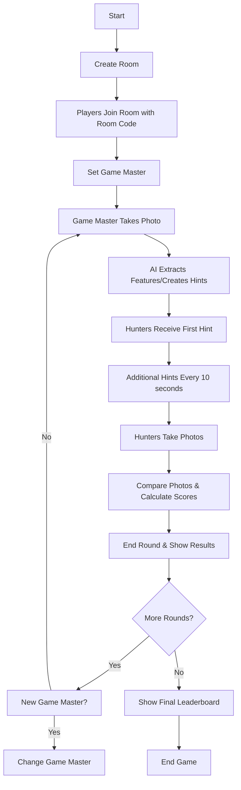

```txt
npm install
npm run dev
```



### API Endpoints

#### Room Management
- `POST /rooms` - Create a new room
- `GET /rooms/:roomId/info` - Get room information
- `POST /rooms/:roomId/join` - Join an existing room
- `PUT /rooms/:roomId/gamemaster` - Change the game master
- `POST /rooms/:roomId/leave` - Leave a room
- `PUT /rooms/:roomId/settings` - Update room settings
- `GET /rooms/:roomId/leaderboard` - Get leaderboard

#### Round Management
- `POST /rooms/:roomId/start` - Start a new round
- `POST /rounds/:roundId/photo` - Submit a photo
- `POST /rounds/:roundId/end` - End the current round
- `GET /rounds/:roundId` - Get round information
- `GET /rooms/:roomId/rounds` - List all rounds in a room

### Components

#### Server Components
- `RoomObject` - Durable Object managing room and round state
- Handler functions for each API endpoint
- Python service for image similarity comparison

#### Client Components
- `GameRoom` - Manages overall room state and player interactions
- `GameRound` - Handles round-specific gameplay and hint display
- `Leaderboard` - Displays player rankings